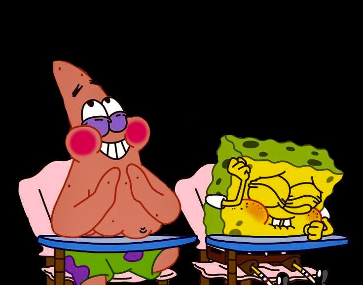

# t25 - Boat Smarts

| Last Name | First Name | CSU eName | GitHub Username | CSU email |
|-----------|------------|-----------|-----------------|-----------|
|    Holmes |    Andrew  |holmesaw   |holmesaw         |holmesaw@rams.colostate.edu|
| McCracken |    Derek   |dsmcc      |dsmccracken      |dsmcc@colostate.edu|
|Cluett     |Caleb       |ccuett     |CalebCluett      |ccluett@colostate.edu|
|Dimitrov   |Iliyan      |iliyan     |IliyanID         |iliyan@colostate.edu|
| Ritz      |    Jake    |jritz11    |jake-ritz11      |jritz11@colostate.edu|

# Team Preferences
Boat Smarts will be working together to complete as many Epics as we can, and we will be making sure that each feature is fully functional before demo day. We will be trying our best to plan ahead to ensure everyone knows what to do and Epics will be completed on time. Each team member will try to get at least 6 hours of work done each week completing tasks on a first come first serve basis unless someone has a specific interest in a task. Major decisions will be made by more than two members, and smaller ones can be made by two.

Every week, as a team, we will decide if we need to meet outside of class. This will be used if members are stuck on a task or to solve any team issues that may come up. These meetings will be Tuesdays any time after 7 pm.

