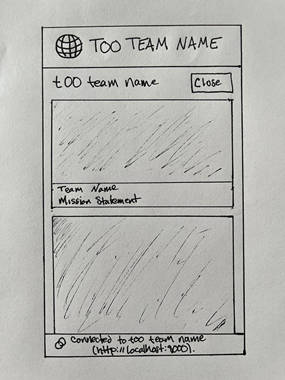
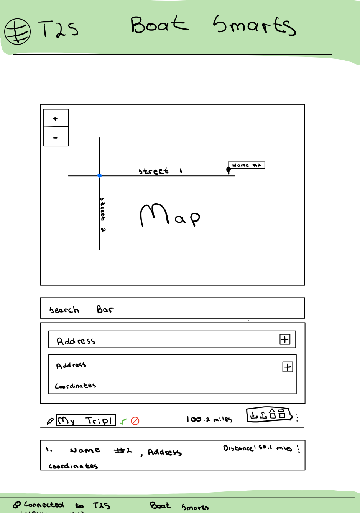
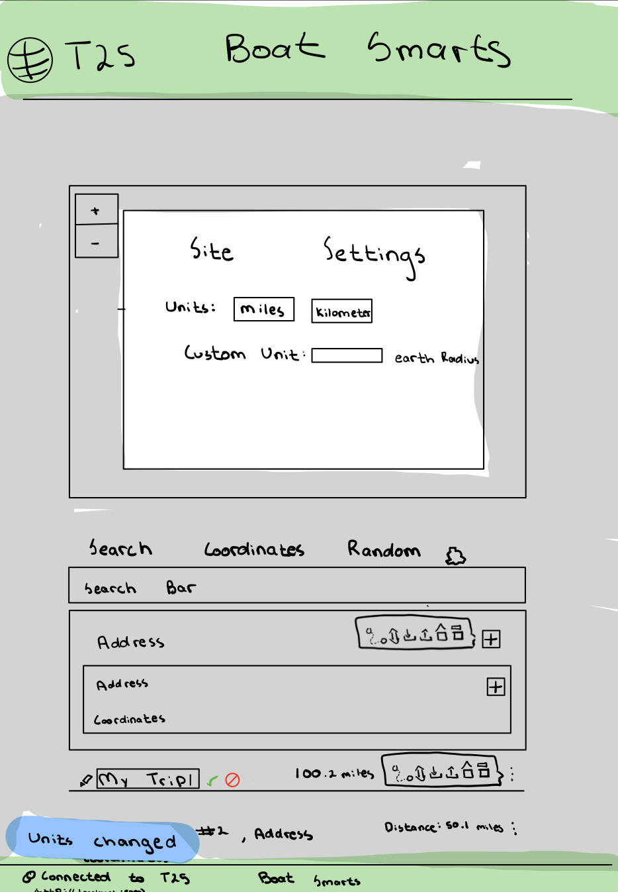
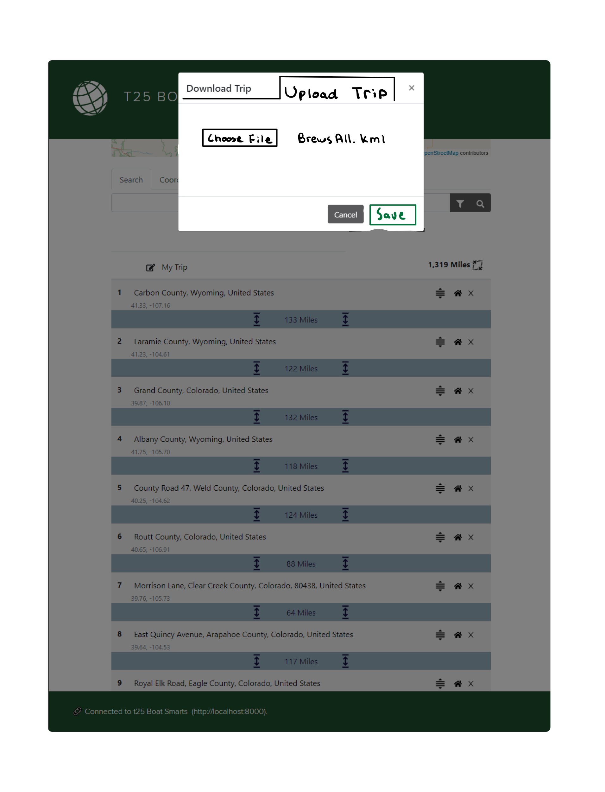

# Introduction

This document describes the architecture and design of a single page web application that interacts with microservices via RESTful APIs.
The key elements in this document include the architecture, user interface, client components, and server classes.

This is a living document that is updated as changes are made each sprint.
The initial document describes the Base code students are given as a starting point for the semester.
Students are expected to update this document as changes are made each sprint to reflect the evolution of their application and key decisions they make.
The Base section serves as an example.

# Base

The Base is a simple application to provide the architecture to the students at the beginning of the semester.
The JavaScript code will be useful examples for students to learn from and leverage in the code they write for sprint 1.
The progressive display of information using collapsible sections and popups will serve as examples of good user interface design.
The overall design is somewhat minimalist/simple for the intended mobile device audience.

### Architecture

The Base architecture is a JavaScript single page web application in an HTML5 browser that uses RESTful APIs to access Micro-services provided by a Java server running on Linux.
The client consists of a minimal index.html file that loads and executes the bundled JavaScript application.
The client and server files are bundled into a single JAR file for execution on the Linux server at a specified port.
The browser fetches the client files from the server on the specified port.

The browser loads the index.html file (by default) which in turn loads the bundled JavaScript single page application bundle.js.
* The single page application makes RESTful API requests to the server on the same port using  JavaScript's asynchronous fetch.  
* A protocol document describes the JSON format for the RESTful API requests and responses.
* JSON Schemas are used to verify requests on the server side and responses on the client side.
* On the client, ReactJS renders the application using ReactStrap, Leaflet, and application defined components.
* GSON is used on the server to convert JSON requests to Java objects and Java objects to JSON responses.
* The client (ulog) and server (SLF4J) logging mechanisms control debugging output during development and production - print statements and console logging should never be used. 

The following architecture elements are not included in the Base system.
They will be added later in the semester.
* Client filesystem.
* Server SQL.
* Server concurrency.

### User Interface

The basic screen in black shows the view on a mobile device, with a header, footer, and trip.
The header contains a earth logo and the team name obtained from the server when the client was loaded.
The footer contains a connection icon along with the current server name and server URL the client is connected to.
The trip shows a map and the current list of destinations.

Rather than buttons or icons to signify actions, we are associating actions with elements that are already on the screen to reduce the clutter.
We are using both popups and collapsible sections in this design rather than choosing to use one exclusively.
* Collapsible/Hidden sections are used for the map and about sections since they have a significant amount of content and we don't need to see them at the same time.
* A popup is used for the URL change since we want to control the interaction until the operation is completed. It seemed more natural than another collapsible section.

#### Clicking on the team name in the header displays an empty about screen.
Clicking again restores the trip screen.
We will fill this in later.

#### Clicking on the map adds to the trip.
Whenever a user clicks on the map, the client should display a marker with latitude, longitude, and a description at that location.
The description is obtained from reverse geocoding.
The location information is also added to the trip list below the map.
We only maintain a single marker at this point displaying the most recently clicked location.

#### Clicking the hamburgers (&#8942;) displays a menu of options.
At the trip level you can add the home (CSU Oval) location or clear the list.
At the destination level you can remove that destination from the list.

#### Clicking on the URL in the footer should let me change the server.
Whenever a user clicks on the URL a popup should open showing the team name, the URL in an input text box, and a Cancel button.
When the user modifies the URL, the client will attempt to connect to the new server and update the configuration.
When the Test button is clicked, it will attempt to connect to the server.
If not successful, nothing changes and the user may continue to make URL changes or click the Cancel button to return to the original sever (it shouldn't change).
If successful, the new server name should appear and a Save button should replace the Test button.
When the user clicks the Save button, the server connection should change and the popup closes, revealing the new servername and URL in the footer.

### Component Hierarchy
The component hierarchy for the base application depicted below shows the our top level App component with four children components.
* App renders the major components on the screen.
* Header renders an icon and a team name in the top banner.
* Footer renders the current server connection in the bottom footer.
* Atlas renders a map.
* About renders information about the team.

We do not show the many ReactStrap components in this hierarchy, even though they will appear when you are debugging on the client.

### Class Diagram
The class diagram for the base application depicted below shows the basic structure of the web server application.

The classes in blue represent the classes specific to this application.  
* WebApplication processes command line parameters and creates MicroServer.
* MicroServer start a web server on the given port, configures the server for security, static files, and APIs for different types of requests, and processes the requests as they arrive.
* JSONValidator verifies a request is properly formatted before attempting to process it using JSON Schemas.
* ConfigRequest is a specific request that allows the server to respond with its configuration to allow interoperability between clients and servers. 
* Request defines the basic components of all requests.
* BadReqeustException allows us to distinguish bad requests from other types of exceptions that may occur.

These test classes provide automated tests for unit testing.
* TestWebApplication
* TestConfigRequest
* TestJSONValidator

# Sprint 1

### User Interface

In this sprint, we will focus on team information.
There are two primary parts:
* browser tab, header, and footer.
* about page which includes team and member information,

Whenever a user clicks the team name in the header, a collapsible section should appear under the header with information about the team.
The collapsible map should disappear so only the about or map are displayed.
A simple toggle in state should be able to control this rendering.
The about page should contain the team name as a heading. 

The team name in the browser tab, header and are simple changes to constants in the client and server.

### Client Components

We will add 3 new components to the base architecture on the client to support the about page.
* Team component will render the team information
* Person component will render the individual information for a team member
* AboutCard component will render the team/individual information in a consistent fashion.

The existing About component will be modified to control the layout of the Team and Person components on the page.

### Server Classes
There are no changes to the server class structure in this sprint.
Only minor changes to text constants are required.

# Sprint 2

### User Interface

Our Search and Results components will be rendered below the map and above the trip. Each of the elements of the results will have collapsible details and an option to add the location to the user's trip.

Users will have the ability to highlight elements of a planned trip. The highlighted element will also be displayed under a marker on the map. Additional functionality will be included to center the highlighted element on the map.

The server connection modal, where the server connection can be altered, has been updated to include the list of features. There will also be an error pop-up to notify the user of any missing features.

### Client Components

We will be adding three components to the base architecture during this sprint.
* Search component will render the search bar
* Results component will render the search results
* LocateMe component will render over the map which will find the user's location and query about adding location to trip

The Planner component will render the Search component. The Search component will render the Results component.

### Server Classes

We are adding 5 items to the server structure
* FindRequest.json is used to validate the incoming find requests
* FindRequest.java handles recieving find requests and building the response
* SQLDatabase.java oversees database queries
* SQLCredential.java creates a valid url for the database with the required permissions
* SQLQuery.java builds query strings from a given set of conditions

The existing ConfigRequest class will be modified so that *find* is listed as a supported operation.

# Sprint 3

### User Interface

The name of the trip can be changed by clicking on the name or pencil icon and typing in the input. To save the changes you can click off or click on the green checkmark. To revert the changes you can click on the red cancel button. Additionally, if the user wants to download or upload a trip they can click on the three dots next to the trip and select the upload or download icon. The total distance is listed next to the itinerary name. The individual distances are listed next to the options dots on each destination.

When the user selects the download option a new screen will popup.  The user will have the option to set the default file type for the downloaded trip. The user has the option to change the file trip name and type. The name of the file defaults to the name of the trip. When pressing the download button the trip will be downloaded in the requested file type.

When the user selects the upload option a new screen will popup. There they can search and upload a pre-existing trip. Below that will be a list of supported file types that can be uploaded. If the user attempts to upload an unsupported file type an error message will popup on the bottom of the screen.

### Client Components

We will be adding three components to the base architecture during this sprint.
* The Itinerary actions will handle file loading/saving.
    * The LoadFile modal will allow the user to upload a file from their local file system and see the trip in the 'My Trip' section.
    * The SaveFile modal will allow the user to save the current trip as a file to their local disk with options for file format.
* The trip name will become its own component that will hold the trip name and will be applied as the default file name when saving. When loading a file, the data will be checked for a name, if it is not present, the file name will be used for the trip name.

In addition to the new components, the places in the trip list will show the distances throughout the trip; from place A to B as well as overall total distance. 

### Server Classes

We are adding 3 items to the server
* DistancesRequest.json is used to validate incoming distance requests
* DistancesRequest.java handles recieving distances requests and building the response
* DistanceCalculator.java calculates a single distance between a pair of coordinates

# Sprint 4 

### User Interface
We are adding a number of new buttons to the main page. A settings button will be added next to the random button which will house the Units epic. Next to the search bar there will be a Filter button which will open a filter modal. Under the three dots there will be the option to reverse the trip.

Under the site settings modal the user will have the option to set the units to miles, kilometers, and a custom unit. When the user chages the units a blue popup will come up confirming their choice.

When the user selects the filter button this Search Filter modal will popup. There will be two options to select. Location types and Country can be selected by the user. Location Types will filter by type from the server. Country can be used to select the type of country to filter by. When the user selects a new option a blue popup will come up stating that the filter change is in effect.

The user can select the optimize trip button which will reorder the itenerary with the most efficient trip. There will be the option to confirm or revert the changes. The user will also be able to grab an idvidual trip and reorder them. The user will also be able to select a specific trip and set it to be the start of the itenerary. They will also be able to delete it.

### Client Components

This sprint, our team will be adding two major components to the architechture of our code.
* The SettingsModal will provide a modal to show user settings options. 
    * This sprint we will add the option of selecting between miles, kilometers, or a user defined unit.
* The FilterBy section will allow the user to pick values for type or country to filter the search results.
    * The types will be available as check boxes.
    * The countries will be available in a select dropdown (allowing for multiple selections).
    * The filter by section will also show pills with the current active filter terms.

Beyond the two new large components, some existing components will change to accommodate additional features. We will add a 'Shorter trip' button that will propose a shorter trip to the user. The user will be able to accept or decline the shorter trip before saving.

The trip will also be modifiable. The user will be able to choose a new starting point, reverse the trip, reorder the destinations, and remove individual destinations within the trip.

Further changes may arise as a result of the user experience interviews our team conducts with users outside of CS 314.

### Server Classes

We added 5 items to the server structure for tour requests
* TourRequest.json is used to validate incoming tour requests
* TourRequest.java handles receiving tour requests and building the response
* TourCalculator.java oversees optimization of the trip
* OneOpt.java Optimizes a trip using the Nearest Neighbor algorithm
* TwoOpt.java optimizes a trip using the 2-opt algorithm

We also added 2 items to manage type and where specification
 * DistinctTypes.java generates an SQL clause for matching the type
 * DistinctCountry.java generates an SQL clause for matching country names

# Sprint 5

### User Interface
The user will be able to access the map from any point on the site. The user will be able to collapse the map to free up the screen. The user will be able to access trip features from icons found at the top of the map. The user will be able to change the theme of the map by selecting themes from the bottom right hand of the map.

The user will be able to modify trip settings by selecting the gear icon in the top of the map. Inside they will have the option to automatically run the tuor request. They will also be able to select and andd units by using the drop down. New units will be saved and appear in the dropdown.

The files upload and download modal will be combined. The use will be able to select between the upload and download tab. Inside the download tab the user can select two new file types; The SVG and KML file types. 

When the user selects the file upload tab they will be welocmed with a sceen to upload a pre-existing trip.

### Client Components

With the addition of the OptimizedTrip component and the SettingsModal, we have finished adding all of the major components. The improvements we make this sprint will be, primarily, to imrove the UI/UX of our product.

### Server Classes

We did not add any new items to the server, but made changes to existing components to ensure they run correctly

